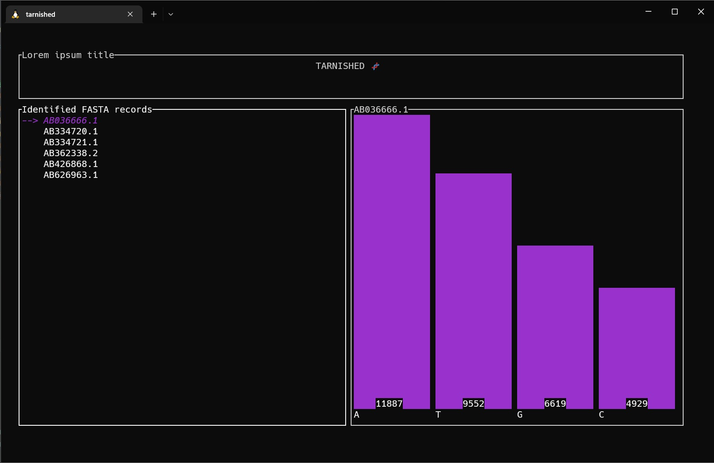

# Blackie
Simple CLI app for testing the % of true black pixels in a pic.

I don't know what more.

# Installation
With cargo:
```
cargo install blackie
```

Locally:
* Clone this repo and cd into it. Then:
```
cargo install --path .
```
* Copy exec from target/release to some dir in PATH

# Usage
### Help
```
Tarnished 0.1.0
Miłosz Chodkowski
App for testing the nucleotide abundance in fasta files

USAGE:
    tarnished <files>...

FLAGS:
    -h, --help       Prints help information
    -V, --version    Prints version information

ARGS:
    <files>...    files in fasta format ending with [.fa | .fna | .fasta]
```
### Command
```bash
>>> tarnished *.fna
```
### Result



# License
* GPLv3